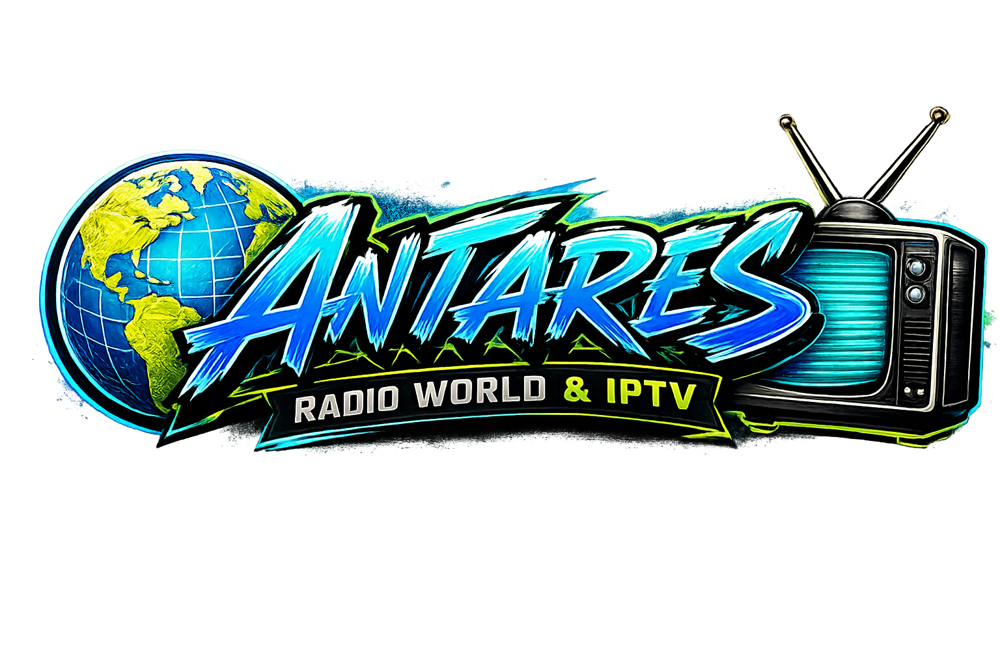
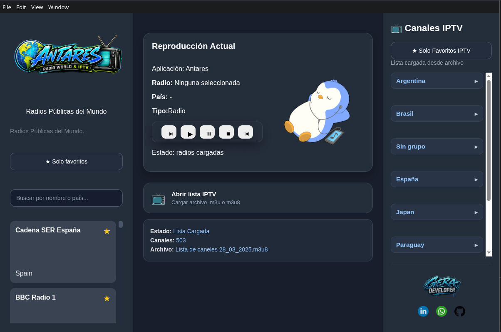
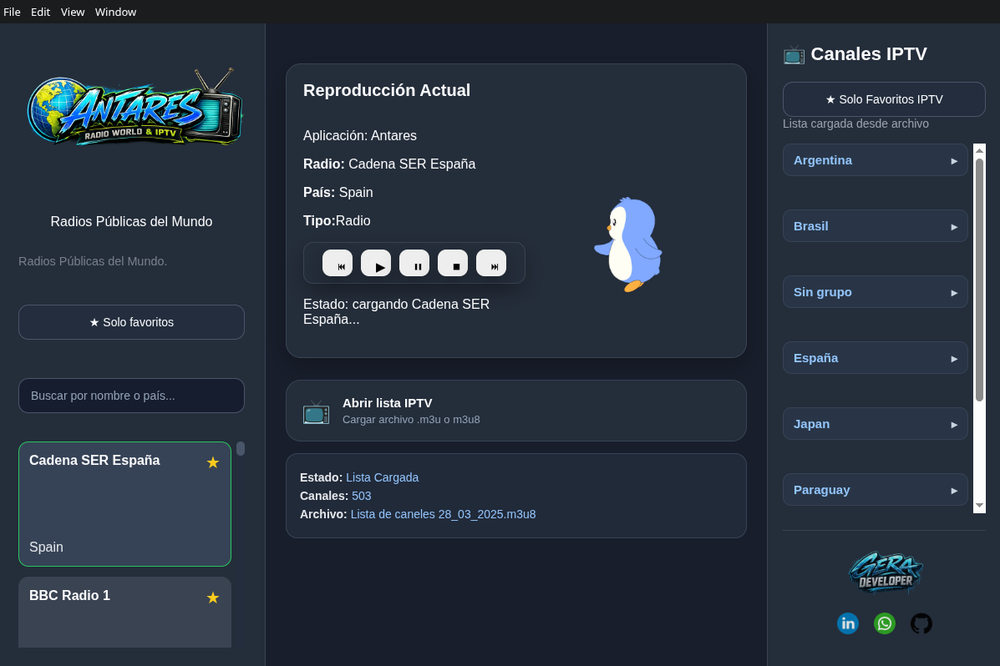
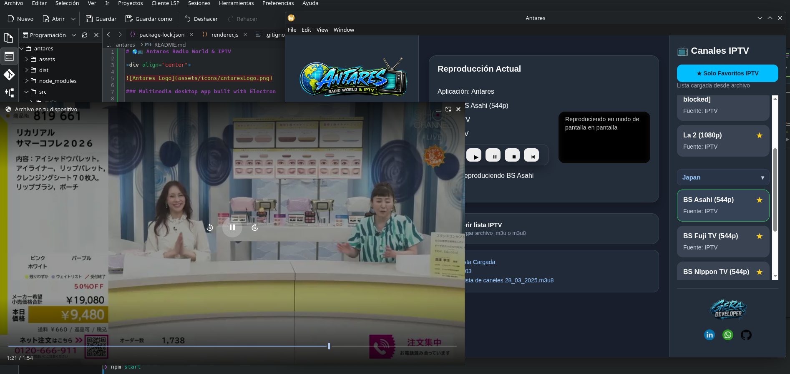
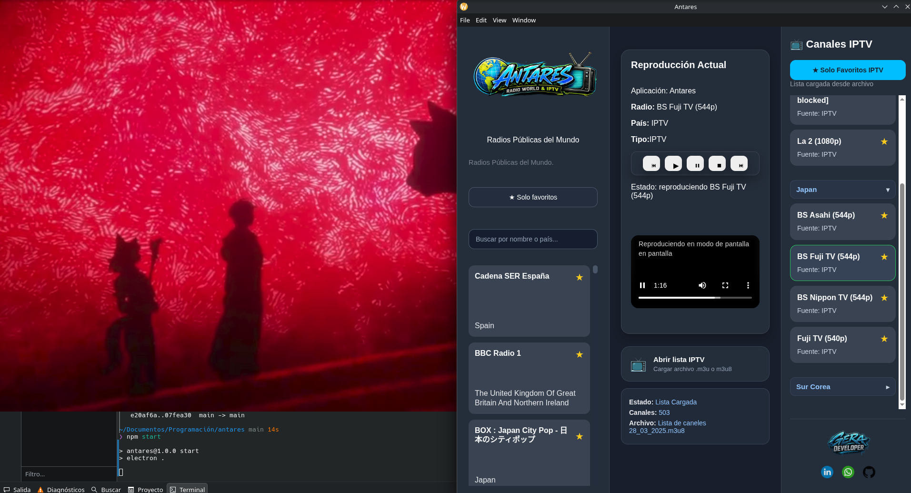

# 🌎📺 Antares Radio World & IPTV

<div align="center">



### Multimedia desktop app built with Electron

Radios públicas del mundo + IPTV del usuario  
Simple, lightweight and modern.

</div>

---

# ✨ Features

✅ Public online radios  
✅ IPTV support (.m3u / .m3u8)  
✅ Favorites system  
✅ Previous / Next playback controls  
✅ IPTV persistence between sessions  
✅ Responsive dark UI  
✅ Electron desktop application  
✅ Windows packaging support

---

# 🖼️ Screenshots

## Main Interface






---

# 🛠️ Technologies Used

- Electron
- JavaScript
- HTML5
- CSS3
- HLS.js

---

# 🚀 Installation

## Clone repository

```bash
git clone https://github.com/GerardoMorel/antares.git
cd antares
```

## Install dependencies

```bash
npm install
```

## Run application

```bash
npm start
```

---

# 📦 Windows Build

Generate Windows installer:

```bash
npm run dist:win
```

Installer will appear inside:

```text
dist/
```

---

# ⚠️ Disclaimer

Antares does NOT provide IPTV lists.

Users must load their own `.m3u` or `.m3u8` playlists.

This project was created for educational and multimedia purposes.

---

# 👨‍💻 Developer

<div align="center">


### Gerardo Morel

</div>

### Contact

- GitHub: https://github.com/GerardoMorel
- LinkedIn: https://linkedin.com/in/gerardomorel27
- WhatsApp: https://wa.me/549376154501854

---

# 📄 License

MIT License
